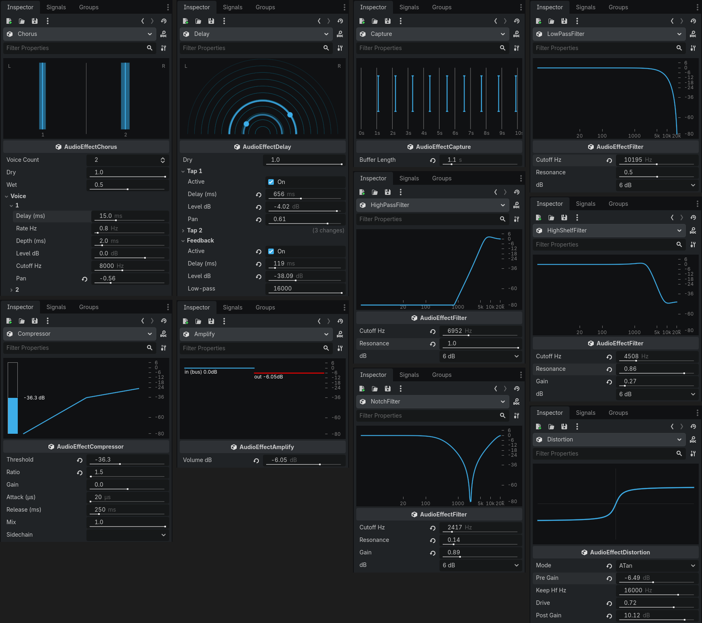

# Audio Wizard

For those who are tired of blindly changing parameters of audio effects in Godot.

> [!NOTE]
> Supported engine versions: 4.6+

**Currently supported effects:**

- Amplify
- All filters
- Capture
- Chorus
- Compressor
- Delay
- Distortion

## Similar addons:

Godot 3.2: https://github.com/NoodleSushi/AudioEffectInspector_GodotAddon
